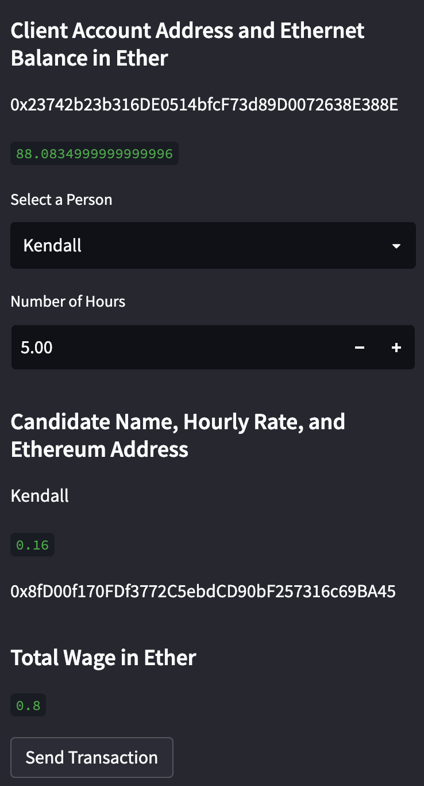
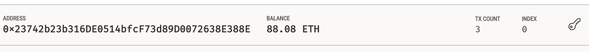
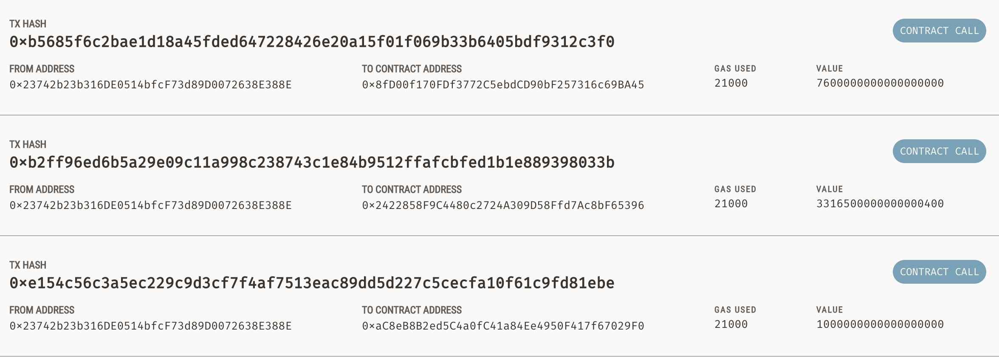
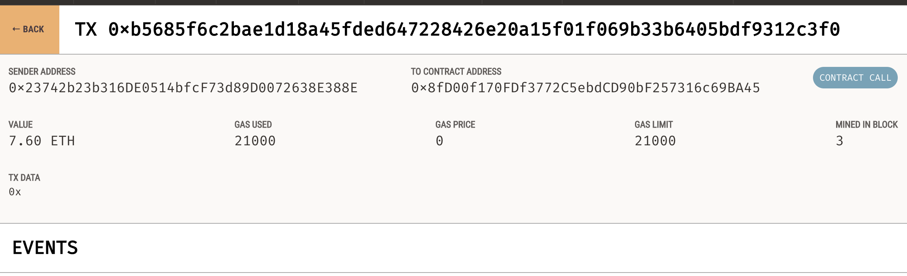

# Blockchain_Wallets

The purpose of this project was to develop an application called Fintech Finder, which is intended to allow its clients to hire fintech professionals from a given database, and pay them using the Ethereum cryptocurrency. In order to accomplish this goal we created a sample database of fintech professionals and provided their Ethereum accoount address and hourly rate, along with their name and Fintech Finder rating. Then, using Ganache to integrate the ethereum blockchain network with our app, we sent these professionals test payments. This was done using a web interface created by using the streamlit library. 

To launch the app navigate to the folder containing the fintech_finder.py file in terminal, and enter the command: streamlit run fintech_finder.py

Upon launching our app you will notice the database of fintech professionals from which to choose. Additionally, you will see a sidebar which contains everything required to execute a payment. At the top of the sidebar is the client's wallet address, and directly below that is the ethereum balance contained within that wallet. Next there is a dropdown menu to choose the fintech professional our client wishes to hire, and an input feature to enter the number of hours for which the client would like to hire them. Finally, at the bottom of the sidebar, the total wage is displayed and there is a "send transaction" button to submit the payment. Once the transaction is executed the client's account balance will be updated, and the transaction will be recorded on the blockchain in Ganache. 

The following image illustrates our app's sidebar feature:

The following image shows the client's account balance in Ganache:

The following image displays a history of the 3 test transactions made using the app:

The following image shows the specific details of the 3rd transaction in which we sent 7.6 ether to Jo's wallet address for 40 hours of work:

